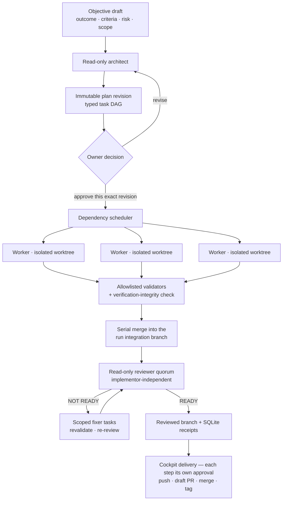

<div align="center">

# DevHarmonics

### One objective. A verified AI development crew.

**Run several AI coding agents on your own repository at once — each in its own Git worktree, checked by commands you configured, reviewed by a model that didn't write the code, and recorded in a local SQLite ledger you can read after the fact.**

DevHarmonics never merges anything without you. It hands you a reviewed branch and the receipts — and when you say so, it pushes, opens the pull request, merges, and tags, each step on its own explicit approval, all from the dashboard.

[Quick start](#quick-start) · [How a run works](#how-a-run-works) · [User manual](docs/USER_MANUAL.md) · [Architecture](docs/ARCHITECTURE.md) · [Product spec](docs/PRODUCT_SPEC.md) · [Landing page](https://scottconverse.github.io/DevHarmonics/)

[](LICENSE)
[](https://github.com/scottconverse/DevHarmonics/releases/tag/v0.6.1)
[](package.json)
[](#requirements)
[](#project-status)

</div>

---

Runs entirely on your machine · No model API keys for normal use · One isolated worktree per task · Every attempt, check, and verdict persisted in SQLite · No automatic merge

<!-- Add a current dashboard screenshot here: docs/assets/dashboard.png -->

## The problem this solves

Pointing one AI coding agent at a repository is easy. Pointing five at it is not.

They collide in the working tree. The "tests passed" claim comes from the same process that wrote the code. When something looks finished, you cannot reconstruct which model touched which file, which check actually ran, or whether the check could have failed at all. And the moment you scale past one agent, the honest question stops being *did it write code?* and becomes **did anything real get verified?**

DevHarmonics answers that question structurally rather than by trusting the agent:

- Each task gets its own Git branch and temporary worktree, so parallel work cannot collide.
- Models choose a validator **by name** from your config. They cannot hand DevHarmonics a shell command to run.
- The final review is read-only, done by a different model, and — at medium and high risk — by a model that was not the implementor.
- Reviewers are decorrelated by **evidence lens**, not just by provider: an artifact-lens reviewer judges the diff and repository without ever seeing the workers' reports, while a claims-lens reviewer judges the reports without ever seeing the code — and a deterministic gate cross-checks the claimed file changes against the integrated diff. A worker that narrates changes it never made fails on the mismatch, mechanically.
- The integration diff is inspected for signs that the *verification itself* was weakened — deleted or skipped tests, weakened assertions, unconditional success, swallowed errors.
- A write task that changed no files does not pass.
- Every invocation's tokens and cost land in the ledger, and each run can show its actual cost beside what the same work would have cost on the priciest qualified model — the saving from routing cheap-where-proven is a number, not a feeling.

---

## How a run works



Planning, approval, execution, and review are separate durable stages. Saving an objective starts nothing. Each architect proposal is appended as a numbered, immutable plan revision; approving one marks that exact revision, and the run executes the stored plan rather than silently regenerating it. Restart the machine and the record of what you authorized is still there.

---

## What it actually does

<table>
<tr>
<td width="50%" valign="top">

### Plan before anything moves

A read-only architect turns your objective into a typed, dependency-aware task graph. You preview the DAG, the repository impact map, permissions, checks, proposed model assignments, and capacity — then approve one exact revision or send it back.

</td>
<td width="50%" valign="top">

### Isolate every agent

One temporary Git branch and worktree per task. Tasks merge serially into a run integration branch, dependents start only after their dependencies land, and your checked-out branch is never touched.

</td>
</tr>
<tr>
<td width="50%" valign="top">

### Check with commands you chose

Validators come from `.devharmonics/config.json` only. For Node projects DevHarmonics discovers existing `test`, `lint`, `build`, and `typecheck` scripts; every project also gets a built-in `diff-check`. Failed checks return exact stdout, stderr, exit code, and duration to the worker for a bounded retry.

</td>
<td width="50%" valign="top">

### Review independently

Reviewer count, minimum distinct providers, and implementor independence are configured per risk tier. Blocking findings become scoped fixer tasks; the changed branch is revalidated, the superseded review evidence is invalidated, and a fresh quorum is required before `READY`.

</td>
</tr>
<tr>
<td width="50%" valign="top">

### Keep receipts that survive a restart

Runs, tasks, attempts, checks, reviews, and typed events live in SQLite. Review receipts are bound to hashes of the exact plan, check evidence, task reports, diff, and repository base/HEAD set — the evidence exporter fails closed when they no longer match.

</td>
<td width="50%" valign="top">

### Steer without opening a terminal

While a run is working you can hold and resume task admission, reprioritise or reassign a queued task, deliver a clarification at the next attempt boundary, or interrupt an active attempt — which stops it, keeps it as evidence, and continues in a new attributed attempt.

</td>
</tr>
<tr>
<td width="50%" valign="top">

### Run it again as a workflow

A workflow is a versioned, parameterized document in the tracked `workflows/` directory, identified by content hash. Instantiate it with typed inputs and it becomes a normal objective through the same composer — and the run pins the exact revision it executed, immutably. Editing a workflow can never rewrite what a historical run did, and promoting a pilot can never silently widen its permissions.

</td>
<td width="50%" valign="top">

### Deliver without leaving the cockpit

For a `READY` run: push the exact reviewed SHA, open a draft pull request, merge it, and tag the release — from the dashboard, each step its own explicit approval and receipt. The merge refuses conflicts, red or pending checks, and a head that drifted from the reviewed commit.

</td>
</tr>
</table>

An **Inbox** view collects every plan approval, delivery approval, and paused run waiting on you across every run in one list — the same approvals as inside each run, never a second gate — alongside a **Program status** panel showing every run's state at a glance.

---

## The part most orchestrators skip: verifying the verification

An agent under pressure to make a gate go green has cheaper options than fixing the code. It can delete the failing test, skip it, weaken the assertion, append `|| true`, or wrap the failure in an empty `catch`. Every one of those produces a green run.

DevHarmonics reads the integration diff for exactly this, before the reviewer ever sees it ([`src/verification-integrity.ts`](src/verification-integrity.ts)):

| Finding | Severity | What it catches |
|---|---|---|
| `test-deleted` | Critical | A test file removed from the diff |
| `test-focused` | Critical | A new `.only` / `fit` selector that silently excludes the rest of the suite |
| `unconditional-success` | Critical | New `\|\| true`, `exit 0`, `process.exit(0)`, `assert.ok(true)` |
| `test-skipped` | High | Newly added `.skip` / `.todo` / `xit` |
| `test-filtered` | High | A new `--test-name-pattern`, `--grep`, `pytest -k`, `jest -t` narrowing the executed census |
| `assertion-weakened` | High | A diff that removes more executable assertions than it adds |
| `swallowed-error` | High | A newly introduced empty `catch` block |
| `placeholder` | Medium | New `TODO`/`FIXME`/`not implemented` standing in for the requested behavior |

Alongside it sits a smaller gate that came out of running this system against real repositories: **a write task whose branch changed nothing against its base commit does not pass.** The worker is told plainly that its attempt produced no repository change, and gets one bounded retry to either make the edit or explain why no change is needed. A validator that finds no fault with an empty diff is not evidence of success.

> [!NOTE]
> This is a heuristic diff analysis, not a proof. It catches the common shapes of a weakened gate; it is one layer under the independent reviewer, not a replacement for it.

---

## No API keys for normal use

DevHarmonics is an orchestration layer over the **official** provider CLIs. It does not proxy provider HTTP APIs, and it never asks for an OpenAI, Anthropic, or Google password — authentication happens only in provider-owned terminals and browser pages.

Common model API-key and cloud-credential environment variables are stripped from every provider child process. Credential-shaped strings are redacted at the ledger boundary before prompts, output, errors, checks, reviews, and events are persisted or returned through the dashboard.

| Transport | Status | Auth | Notes |
|---|---|---|---|
| Codex CLI | Supported | `codex login` | Subscription session owned by the CLI |
| Claude Code | Supported | `claude auth login` | Subscription session owned by the CLI |
| Google Antigravity | Supported | first-run `agy` sign-in | One connection whose catalog may expose Google, Anthropic, **and** OpenAI models; its Gemini and Claude/GPT quota groups cool independently |
| Ollama (local) | Partial | none | Discovered locally; schedulable only after exact-fingerprint qualification. Reviewers get bounded diff chunks; implementors get scoped `file.read` / `file.search` / hash-checked `file.patch` inside their worktree — no shell, commit, merge, or external write |
| OpenRouter | Optional, off by default | OAuth | Disconnected and paid routing disabled by default. Spending needs three policy gates plus per-run and monthly caps. You never paste a key |
| Agent Client Protocol | Planned | — | Contract-defined; no transport yet |

> [!IMPORTANT]
> Planning requires at least one signed-in subscription CLI — no local model is qualified for the architect role. An **already-approved** plan does not: qualified local models can carry and review the work with every subscription signed out.

---

## Quick start

### Requirements

- Windows, macOS, or Linux
- **Node.js 24 or newer**, and Git
- A Git repository you want to change, with a clean working tree
- At least one installed and signed-in provider CLI (see the table above)

### Install from source

```powershell
git clone https://github.com/scottconverse/DevHarmonics.git
Set-Location DevHarmonics
npm.cmd ci
npm.cmd run build
node dist/src/cli.js doctor
node dist/src/cli.js serve --project C:\path\to\your\repository
```

`doctor` reports each provider across separate configuration, installation, authentication, account-visibility, model-entitlement, control-plane-health, capacity, and assignment-availability layers. Model entitlement and remaining subscription capacity stay explicitly **unknown** until verified — a successful login is not presented as proof of either.

The last command opens the dashboard at `http://127.0.0.1:4317`. Leave the terminal open.

To make the command global from this checkout:

```powershell
npm.cmd link
devharmonics --version
```

> [!NOTE]
> There is no packaged installer or npm registry release yet. Source checkout is currently the only distribution.

### The dashboard

Seven screens, served from `127.0.0.1` with no build step and no frontend framework: **Runs**, **Workbench**, **Products**, **Workflows**, **Setup**, **Models**, **Evidence**.

### Or drive it from the CLI

```text
devharmonics serve   [--project PATH] [--port 4317] [--open false]
devharmonics init    [--project PATH]
devharmonics doctor  [--project PATH]
devharmonics run --goal "..." [--project PATH] [--agents auto|N]
                 [--autonomy observe|supervised|bounded]
                 [--providers codex,claude,gemini]
devharmonics --version
```

```powershell
devharmonics run --project C:\repos\shop --agents auto `
  --providers codex,claude,gemini `
  --goal "Add CSV export, cover it with tests, and verify the download"
```

`--agents` is not clamped: there is no product-level agent ceiling. Effective parallelism is still bounded by ready tasks, machine resources, provider throttling, and subscription limits.

`--autonomy observe` is fail-closed — every task must be diagnostic, read-only, and low risk, and read-only worker output must carry path/line evidence where the task contract requires it.

---

## Project configuration

The first `init`, `serve`, or `run` creates a runtime directory inside the target project and adds it to that repository's private `.git/info/exclude` — the shared `.gitignore` is left alone.

```text
.devharmonics/
  config.json
  constitution.md
  devharmonics.db
```

<details>
<summary><strong>Abridged <code>config.json</code> (schema version 2)</strong></summary>

The generated file contains more than this; version 1 files from earlier releases are migrated forward automatically.

```json
{
  "version": 2,
  "application": {
    "concurrency": { "mode": "auto", "agents": 8, "ceiling": null },
    "retry": { "maxAttempts": 3, "backoffMs": 1500 }
  },
  "connections": {
    "codex":  { "enabled": true, "command": "codex",  "timeoutMs": 1800000 },
    "claude": { "enabled": true, "command": "claude", "timeoutMs": 1800000 },
    "gemini": { "enabled": true, "command": "agy",    "timeoutMs": 1800000 }
  },
  "product": {
    "architect": "claude",
    "reviewer": "codex",
    "workers": ["codex", "claude", "gemini"]
  },
  "repository": {
    "validators": {
      "diff-check": { "command": "git", "args": ["diff", "--check"], "timeoutMs": 60000 }
    }
  },
  "runPolicy": {
    "autonomy": "supervised",
    "requirePlanApproval": false,
    "allowPaidApi": false,
    "allowExternalWrites": false
  },
  "reviewPolicy": {
    "reviewerCountByRisk": { "low": 1, "medium": 1, "high": 2 },
    "minimumDistinctProvidersByRisk": { "low": 1, "medium": 1, "high": 2 },
    "requireImplementorIndependenceByRisk": { "low": false, "medium": true, "high": true },
    "maxFixRounds": 2
  },
  "openRouter": { "enabled": false, "allowPaidFallback": false, "perRunLimitUsd": 0, "monthlyLimitUsd": 0 }
}
```

`gemini` is the internal compatibility key for the Google Antigravity connection. Validator commands and arguments may use a `${repoRoot}` token, expanded to the owning repository's root — which keeps a registered validator portable across checkouts.

</details>

---

## Beyond a single repository

Most real products are several repositories that ship together. DevHarmonics models that without pretending they are a monorepo.

Register a **product**, then attach each local Git checkout with its role, expected branch, owners, dependencies, validator commands, and governance sources. Inspection is read-only Git: DevHarmonics records the observed branch, HEAD, origin, dirty state, and compatibility issues, and never checks out, fetches, resets, stashes, or modifies a registered checkout.

**Canonical intelligence sources** go a step further. Point DevHarmonics at the governance, architecture, version, status, compatibility, and release files that actually matter in each repository, and a scan produces an immutable snapshot with exact revisions, SHA-256 content hashes, working-tree state, explicit subject-aware claims, unavailable-source findings, and cited contradictions with path and line numbers. Git tags are deliberately not read as product claims. The latest bounded findings are injected into planning.

Execution then creates an **exact integration set**: an independent integration branch and worktree per affected repository, each pinned to a retained base commit. Tasks in different repositories run concurrently; merges into the same repository stay serialized. Blocking review findings must name exactly one repository — an unscoped finding fails closed rather than being guessed at.

> [!WARNING]
> Multi-repository execution supports **one repository per task**. It does not yet reconstruct an interrupted integration set after a restart, clean retained worktrees automatically, or let a single task mutate several repositories.

---

## Delivery, and the line DevHarmonics will not cross

The line is this: **nothing leaves your machine without an explicit owner approval for that specific action.** There is no automatic merge, no automatic tag, and no standing permission — approving a push does not approve the pull request, and approving the pull request does not approve the merge.

Within that line, delivery is complete from the dashboard. For a `READY` run, the board shows the exact base branch, base commit, reviewed HEAD, and delivery branch, and you can take the whole delivery to done without opening GitHub: push that exact SHA, open a **draft** pull request, merge it, and tag the release — each step minting its own external-write approval and tool-policy receipt. A one-click complete flow runs the remaining steps, still one approval per consequential action. This exists because the product is meant to be the whole dev team for a product manager, and product managers do not log into GitHub to finish a delivery.

The merge step is never blind: it checks the live pull-request state and refuses merge conflicts, pending or failing status checks, and a pull-request head that is no longer the reviewed commit. Tagging validates the tag name, tags the actual merge commit, records the applied tag, recovers a failed tag push by reusing the local tag, and refuses a different tag on an already-tagged delivery. Completed steps reconcile idempotently, concurrent operations on the same repository are refused, and the UI locks the delivery card while a step is in flight.

External writes are off by default (`runPolicy.allowExternalWrites`).

> [!NOTE]
> Pull-request creation and merge shell out to the GitHub CLI (`gh`), which must be installed and authenticated. The branch push and tag use `git` directly.

---

## Architecture

A single Node process: a loopback HTTP server, a dependency-free browser UI, an orchestrator, and a SQLite ledger. No daemon, no queue broker, no container, no hosted control plane.

Everything provider-specific sits behind one `RuntimeAdapter` contract covering connection, model selection, invocation, events, results, usage, and **classified** failures — which is why a subscription CLI, a local Ollama runtime, and an OAuth API transport can be scheduled, cooled, and failed over by the same code path, and why adding a transport does not mean touching the orchestrator.

<details>
<summary><strong>Module map</strong></summary>

| Path | Responsibility |
|---|---|
| [`src/cli.ts`](src/cli.ts) | `serve`, `init`, `doctor`, `run` |
| [`src/server.ts`](src/server.ts) | Loopback HTTP API, persisted SSE stream, static dashboard |
| [`src/orchestrator.ts`](src/orchestrator.ts) | Planning, scheduling, retries, integration, review, steering, cancellation |
| [`src/ledger.ts`](src/ledger.ts) | SQLite persistence and its ordered transactional migrations |
| [`src/runtime.ts`](src/runtime.ts) · [`src/providers.ts`](src/providers.ts) | Transport-neutral contracts and provider process adapters |
| [`src/worktrees.ts`](src/worktrees.ts) · [`src/integration-sets.ts`](src/integration-sets.ts) | Task/integration worktrees and multi-repository coordination |
| [`src/validators.ts`](src/validators.ts) · [`src/verification-integrity.ts`](src/verification-integrity.ts) | Allowlisted check execution and gate-weakening analysis |
| [`src/policy.ts`](src/policy.ts) · [`src/local-tools.ts`](src/local-tools.ts) | Tool trust/side-effect policy and the scoped local-model tool loop |
| [`src/routing.ts`](src/routing.ts) · [`src/qualification.ts`](src/qualification.ts) · [`src/model-performance.ts`](src/model-performance.ts) | Adaptive selection, first-use qualification, empirical profiles |
| [`src/redaction.ts`](src/redaction.ts) | Centralized secret scrubbing before the ledger and UI boundaries |
| [`src/workflows.ts`](src/workflows.ts) | Versioned parameterized workflow documents, fail-closed parsing, typed instantiation |
| [`src/reporter.ts`](src/reporter.ts) · [`src/delivery.ts`](src/delivery.ts) | Immutable evidence export and approved branch/draft-PR handoff |

Full detail: [docs/ARCHITECTURE.md](docs/ARCHITECTURE.md).

</details>

<details>
<summary><strong>Model routing and why a model was chosen</strong></summary>

Routing is adaptive but auditable. Every concrete decision retains its individual score sources rather than a single total, and the dashboard replays them as **Why this model** evidence: workload tier, qualification state, pins, established reliability and latency, relative catalog price among comparable paid candidates, and provider independence for review.

Empirical profiles are sliced by workload. Under 5 observations is *insufficient*, 5–19 is *emerging*, 20 or more is *established* — and **only established slices may alter reliability or latency routing.** Run-level `NOT READY` participation is displayed as non-causal evidence and cannot penalize a model without task-linked findings.

A qualification fingerprint covers the provider, exact model ID, capability metadata, runtime version, adapter version, and qualification-suite version. When a fingerprint changes, prior evidence goes stale and the model cannot be scheduled until it requalifies. Retirement requires three consecutive authoritative missing observations.

Passing an exact model argument is not treated as proof of which model executed: when the runtime does not report that identity, the receipt keeps the request and marks resolution unverified.

</details>

### Safety boundaries

The dashboard binds only to `127.0.0.1`, and mutation endpoints require same-origin JSON. Architect and reviewer invocations use provider read-only or plan modes; workers use restricted editing modes rather than unrestricted bypass. Prompts are launched without shell interpolation. Validator commands come only from local user-controlled configuration. Parallel work requires a clean Git working tree.

> [!WARNING]
> A run ledger can contain prompts, repository paths, provider output, and validator logs. Migration backups are byte-consistent snapshots of pre-existing data. Protect `.devharmonics/` like any other sensitive local directory.

---

## Project status

**Early public preview, under active development.** Current release: **v0.6.1**.

What that judgement rests on, in both directions:

| Signal | Reading |
|---|---|
| Automated suite | 296 tests across configuration, credential stripping, provider parsing, plan validation, cancellation, SQLite receipts, local-model qualification and chunked review, review-lens quorums and the claims/diff divergence gate, workflow parsing/provenance/promotion guards, cockpit delivery gates, workspace-isolation guards, the inbox/program-status projections, delivered-vs-observed reconciliation, the standalone status export, the dashboard server, and full fake-provider orchestration through real Git worktrees |
| Schema handling | Ordered transactional migrations to ledger schema 35, automatic pre-upgrade backups, integrity + foreign-key validation, rollback on failure, and refusal to open a newer schema |
| Continuous integration | **None in this repository.** The merge gate is the local suite plus independent review — nothing automated catches a regression on push |
| Distribution | Source checkout only. No installer, no published package |
| Operational tooling | Temporary worktrees are retained for inspection until explicit cleanup is added; an interrupted integration set is not reconstructed after restart |

### Known limitations

- A Git **merge conflict** fails the affected task. The automatic fixer handles structured reviewer findings, not conflicts.
- Provider quotas originate with each subscription. DevHarmonics classifies observed failures and can cool and reroute, but reliable remaining-quota telemetry is not consistently available from providers.
- Large CPU-only local reviews can be materially slower than subscription reviewers.
- Manual model registry entries are inventory records only — they imply no account visibility, verification, qualification, or schedulability.
- Local Mellum2 specialists are tracked as two separate upgrade lanes (Instruct and Thinking) and are never downloaded, activated, or promoted automatically; scheduling additionally requires a structured-output, contradiction-detection, and requirement-count benchmark.

### Roadmap

**Available now** — everything above without a *planned* qualifier, including cockpit-complete delivery, live run steering, visible operation feedback, review evidence lenses, per-run cost counterfactuals, and reusable workflows — all proven against a real multi-repository product (the first cross-repository CivicSuite delivery was pushed, PR'd, and merged from the cockpit).
**Planned** — Agent Client Protocol transport; integration-set restart reconstruction; automatic worktree cleanup; one task spanning several repositories.

Planned items are proposals recorded in [docs/IMPLEMENTATION_PLAN.md](docs/IMPLEMENTATION_PLAN.md), not dated commitments.

---

## Who this is for

DevHarmonics assumes a **solo product owner or a very small team** who already pays for one or more AI coding subscriptions, works in Git, and wants parallel agent work without giving up the ability to say what actually happened. It is deliberately local-first: there is no hosted service, no multi-tenant control plane, and no ambition to become an enterprise agent workforce platform.

If you want a managed cloud product, an agent that merges to `main` on your behalf, or a key-based API gateway, this is the wrong tool.

---

## A codebase you can navigate

About 17,500 lines of TypeScript with Zod schemas at every input boundary, exactly one production dependency (`zod`), and a 2,700-line dashboard written in plain HTML, CSS, and JavaScript with no build step.

The integration suite runs **fake provider commands against temporary Git repositories**, so the full orchestration path — planning, worktrees, validators, merges, review — is exercised without a single real credential. Contributions must keep it that way.

```powershell
npm.cmd ci
npm.cmd run check     # version consistency + full suite
npm.cmd run dev -- serve --project C:\path\to\repository
```

Clear places to add capability: a new `RuntimeAdapter` for another transport, a new finding kind in the verification-integrity analyzer, a new validator, or a new routing signal.

Read [Contributing](CONTRIBUTING.md) first. Design proposals start as a GitHub Discussion; bounded reproducible defects as an issue.

---

## Documentation

| | |
|---|---|
| [User manual](docs/USER_MANUAL.md) | Install, provider sign-in, the dashboard, troubleshooting, uninstall |
| [Architecture](docs/ARCHITECTURE.md) | Components, trust boundaries, persistence, deliberate non-features |
| [Product specification](docs/PRODUCT_SPEC.md) | Canonical product definition |
| [Implementation plan](docs/IMPLEMENTATION_PLAN.md) | Increment-by-increment delivery plan |
| [Changelog](CHANGELOG.md) · [Security policy](SECURITY.md) | Release history and private vulnerability reporting |

## License

[Apache License 2.0](LICENSE) — use, modify, and redistribute under its terms, including the patent grant and the requirement to preserve attribution and change notices.
