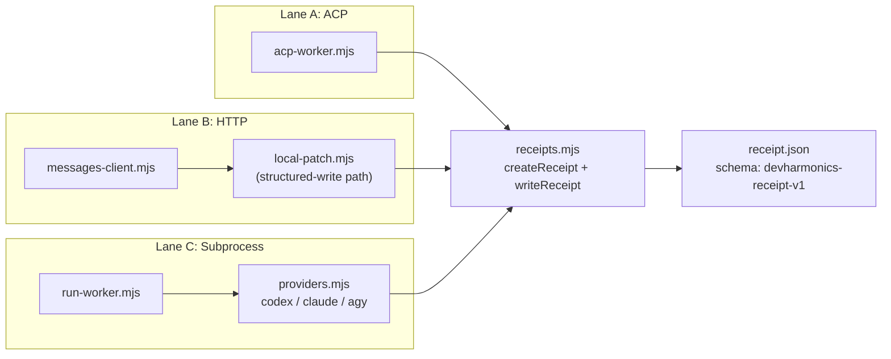

# DevHarmonics Architecture

This document explains how the code in this repository actually works today,
for a contributor or auditor who has not read it before. Every claim below was
checked against `scripts/*.mjs` and `test/*.mjs` while this was written; where
the code is ambiguous or incomplete, that is said plainly rather than smoothed
over. Companion reading: `docs/SPEC.md` (the design plan), `docs/USER_MANUAL.md`
(how to run it, and its known limitations), `docs/FALSIFICATION.md` (an
adversarial pass against the gates), and `docs/INTEGRATION-SETS.md` (the
multi-repo module in depth).

## 1. The one-paragraph model

DevHarmonics is a local-first, host-agnostic software factory: a set of plain
Node.js scripts under `scripts/` that let an AI coding agent make one bounded,
gated change to a git repository, driven from whatever agent app the owner
happens to be sitting in (Claude/Cowork, Codex, Antigravity, or any future
host) through this repository's own CLI (`scripts/cli.mjs`, installed as the
`devharmonics` command). The **coordinator plane** is judgment plus a CLI, not
infrastructure — there is no DevHarmonics server, account, or standing
service. Work happens on three interchangeable **worker lanes** (ACP, HTTP,
subprocess — section 3), so no single vendor's CLI or API is load-bearing.
Every consequential step is a **gate** that can refuse outright (section 4),
and every attempt — whether it succeeds, is refused, or never starts — writes
**evidence** before it reports anything (section 5). The design test the
codebase states of itself, in both `README.md` and `docs/SPEC.md`: **the
factory must survive any single vendor, app, or model disappearing.**
Concretely: the coordinator is a CLI plus a thin per-host skill file, not a
bespoke UI; each worker lane can be replaced by either of the other two; and
the verification layer (`tampercheck`, pinned into each target repository's
own CI by `devharmonics onboard`) keeps enforcing even if DevHarmonics itself
were deleted from the machine.

## 2. Module map

Every file in `scripts/` (26 as of this writing), one line each:

| File | Responsibility |
|---|---|
| `acp-command.mjs` | CLI surface for `devharmonics acp`: argument parsing and text/JSON rendering around a single `runAcpWorker` call. |
| `acp-worker.mjs` | Lane A: drives one bounded ACP session over stdio JSON-RPC via `@agentclientprotocol/sdk`, emitting the shared receipt schema. |
| `admission.mjs` | Append-only `usage.jsonl` ledger for paid/unpaid task attempts — reservation, replay-based summing, and reconciliation — ported from codex-factory. Not currently wired into any command. |
| `cli.mjs` | Entry point and dispatcher: parses the subcommand name, prints usage/version, and lazily imports the matching `*-command` module. |
| `config.mjs` | Default factory configuration (endpoints, CLIs, rigor settings, budgets) plus deep-merge and fail-closed validation of an operator config file. |
| `doctor.mjs` | Runs every configured capability probe (CLIs, HTTP endpoints, tampercheck, skill parity, optional repo governance) and tallies PASS/FAIL/SKIPPED. |
| `fleet.mjs` | Candidate discovery, exact-fingerprint identity, and qualification-aware selection logic; ported from codex-factory's `factory-fleet.mjs`. |
| `integrate.mjs` | The single-repository integration engine: per-repo lock, empty-diff gate, tampercheck gate, serial `--no-ff` merge, always-written evidence bundle. |
| `integration-set.mjs` | Multi-repository planning and orchestration over `integrate.mjs`: per-repo base pinning, concurrent fan-out, all-or-nothing set readiness. |
| `local-patch.mjs` | The HTTP lane's constrained write mode: the model receives file text and returns file text only; this module validates, writes, checks, and commits inside an isolated worktree. |
| `messages-client.mjs` | The one Anthropic-Messages-format HTTP client (`sendMessages`), base-URL-switched, plus the tool-use qualification probe (`probeToolUse`). |
| `onboard-command.mjs` | CLI surface for `devharmonics onboard`: argument parsing and dry-run/apply text or JSON rendering. |
| `onboard.mjs` | Plans and applies the repo-onboarding ceremony: pinned tampercheck CI workflow, private `.git/info/exclude` entry, optional README badge line. |
| `path-resolve.mjs` | Real PATH/PATHEXT command resolution and the Windows-safe spawn plan (ComSpec wrap + cmd-safe quoting), shared by every process-launching module. |
| `probes.mjs` | The individual doctor checks: CLI `--version` probe, a real Messages-endpoint probe, coordinator skill-version parity, and repo-governance verification. |
| `providers.mjs` | Per-provider (`codex`/`claude`/`agy`) subprocess invocation builders and output parsers for the subprocess lane. |
| `qualify-command.mjs` | CLI surface for `devharmonics qualify`: discovers the real candidate pool, prints the dry-run plan, or executes the sweep. |
| `qualify.mjs` | The qualification harnesses themselves (analysis, benchmark, tool_use, structured_write) plus the sweep planner/executor that records pass/fail to the ledger. |
| `receipts.mjs` | Defines the one receipt schema (`devharmonics-receipt-v1`) shared by all three lanes; builds, validates, and writes `receipt.json`. |
| `review.mjs` | Independent artifact-lens review: a model verdict plus a deterministic claims-vs-diff divergence check; always writes a review evidence bundle. |
| `run-command.mjs` | The single-repository pipeline (`runPipeline`) and its CLI surface (`runCommandCli`): intake through every gate to the owner-approval stop, across all three worker lanes. |
| `run-worker.mjs` | Subprocess-lane worker runner: resolves the CLI, builds its invocation, supervises it, parses its output, and always writes a receipt. |
| `set-command.mjs` | CLI surface for `devharmonics set`: parses repeated `--member`/`--base` flags into a plan and runs it through `planIntegrationSet` + `integrateSet`. |
| `slots.mjs` | File-lock primitives — bounded worker slots and a generic exclusive file lock with dead-PID reclaim — ported from codex-factory. |
| `supervise.mjs` | Runs one child process to completion or timeout, capturing stdout/stderr, and kills its whole process tree if the timeout fires. |
| `worker-command.mjs` | CLI surface for `devharmonics worker`: argument parsing and text/JSON rendering around a single `runWorker` call. |
| `worker-env.mjs` | Strips credential-shaped and session-marker environment variables before they reach a worker child process; reports exactly what it removed. |

`cli.mjs` recognizes seven subcommands as of this writing: `doctor`, `worker`,
`acp`, `qualify`, `run`, `onboard`, `set`. Three of those — `acp`, `set`, and
`run`'s widening from one lane to three — landed in `scripts/` while this
document was being written, which is itself worth noting: this codebase
changes underneath a reader quickly enough that "what commands exist" must be
re-checked against `scripts/` rather than trusted from memory or an earlier
reading of this file.

## 3. The three worker lanes

| | Lane A — ACP | Lane B — HTTP | Lane C — Subprocess |
|---|---|---|---|
| **Transport** | stdio JSON-RPC via `@agentclientprotocol/sdk` 1.3.0 (`acp-worker.mjs`) | One Anthropic Messages-API client, base-URL-switched (`messages-client.mjs`) | A supervised child process (`supervise.mjs`) with per-provider argv/stdin built by `providers.mjs` |
| **What it's for** | A live, multi-turn session with streamed updates and permission requests — richer than one-shot text in/out | Local model servers that speak Messages natively, plus (opt-in) the real Claude API; both a live text/tool-use exchange and a constrained file-patch write mode for models that can't use tools reliably | The default, most complete lane: one bounded headless turn against a signed-in subscription CLI |
| **Providers** | Any ACP-speaking adapter the operator installs; the code takes an arbitrary `adapterCommand`/`adapterArgs`, it does not hardcode which adapters exist | Ollama (`127.0.0.1:11434`), LM Studio (`127.0.0.1:1234`), a LiteLLM proxy (`127.0.0.1:4000`) — all in `config.mjs`'s defaults — plus the real Claude API as an explicit opt-in | `codex` (`codex exec`), `claude` (`claude -p`, non-bare), `agy` (Antigravity's `agy -p` Command Mode) — the full set is `providers.mjs`'s `SUBPROCESS_PROVIDERS` |
| **Auth model** | Provider-owned — the adapter's own session/keychain; the factory never handles a credential for this lane | None locally (a placeholder `x-api-key: local` header); a real API key only for the explicit opt-in cloud case | The subscription CLI's own sign-in (ChatGPT/Pro for codex, claude.ai OAuth for claude, Antigravity's own for agy) — never an API key |
| **Receipt production** | `runAcpWorker` builds and writes a `devharmonics-receipt-v1` receipt itself via `receipts.mjs`, including for a spawn failure, a protocol error, or a timeout | `runLocalPatch` (the structured-write path) writes a full receipt after its write-check-commit sequence; the qualification harnesses' plain text round-trips (analysis/benchmark/tool_use) call `sendMessages` directly and record pass/fail to the qualification ledger only — no receipt file for those | `runWorker` always writes a receipt, including when the named command was never found on `PATH` (nothing was ever spawned) |

Reachability today: `devharmonics run` takes `--lane subprocess|http|acp`
(default `subprocess`) and can drive any of the three as the worker making
the change — the exact mechanics of that fork are in section 4.
`devharmonics acp` runs a single bounded ACP worker turn standalone
(mirroring `devharmonics worker` for the subprocess lane); `devharmonics set`
plans and integrates a cross-repository set from repeated `--member
"<repositoryId>=<repoPath>:<workerBranch>"` flags. `devharmonics qualify`'s
HTTP-lane harnesses exercise `messages-client.mjs` and `local-patch.mjs`
directly, independent of `run`.

All three lanes converge on one receipt schema:

## 4. The gate chain

The flow below is `devharmonics run`'s pipeline (`runPipeline` in
`run-command.mjs`, calling `integrateWorkerBranch` in `integrate.mjs`) — the
only place all the gates run together. Every REFUSED branch is a real,
distinct outcome the code returns; nothing here is hypothetical.

```mermaid
flowchart TD
    Start(["devharmonics run"]) --> Intake{"tracked working tree clean?"}
    Intake -- "no (untracked files are fine)" --> R1["THROWS: tracked uncommitted changes — exit 2, nothing created"]
    Intake -- yes --> Exclude["pin HEAD as baseRef; add .devharmonics/ to .git/info/exclude"]
    Exclude --> LaneCheck{"--lane?"}

    LaneCheck -- http --> Http["local-patch.mjs: its OWN isolated worktree —<br/>write, check, commit only on green (section 3)"]
    Http --> HttpOk{"receipt status completed?"}
    HttpOk -- no --> R2["REFUSED: worker-failed<br/>(local-patch's own empty-diff/parse/check failures all land here)"]
    HttpOk -- yes --> BranchRef["git branch workerBranch at local-patch's own commit"]
    BranchRef --> Gate1

    LaneCheck -- "subprocess or acp" --> Worktree["isolated worktree under the OS temp dir,<br/>new branch devharmonics/task/RUN_ID"]
    Worktree --> Worker["worker edits files in it —<br/>subprocess: sandbox=workspace-write, permission=acceptEdits;<br/>acp: permissionMode=allow-edits"]
    Worker --> WorkerOk{"worker status completed?"}
    WorkerOk -- no --> R2b["REFUSED: worker-failed / worker-timeout"]
    WorkerOk -- yes --> Stage["git add -A; inspect staged diff"]
    Stage --> StagedOk{"anything staged?"}
    StagedOk -- no --> R3["REFUSED: worker-empty-diff"]
    StagedOk -- yes --> Commit["git commit on the worker branch"]
    Commit --> CommitOk{"commit succeeded?"}
    CommitOk -- no --> R4["REFUSED: commit-failed"]
    CommitOk -- yes --> CheckGiven{"--check given?"}
    CheckGiven -- no --> Gate1
    CheckGiven -- yes --> Resolve{"validator command on PATH?"}
    Resolve -- no --> R5["REFUSED: validator-unresolvable"]
    Resolve -- yes --> Validate["run --check inside the worker worktree"]
    Validate --> ValidateOk{"exit 0, no timeout?"}
    ValidateOk -- no --> R6["REFUSED: validator-failed"]
    ValidateOk -- yes --> Gate1

    Gate1["integrateWorkerBranch:<br/>acquire this repository's file lock"] --> Gate1a{"diff(mergeBase, workerBranch) nonempty?"}
    Gate1a -- no --> R7["REFUSED: empty-diff<br/>(runs for every lane, unlike the subprocess/acp-only pre-check above)"]
    Gate1a -- yes --> Gate2{"tampercheck resolvable on PATH?"}
    Gate2 -- no --> R8["REFUSED: tampercheck-unavailable"]
    Gate2 -- yes --> Gate2b{"identity check armed<br/>(expectedTampercheckVersion) and mismatched?"}
    Gate2b -- yes --> R8
    Gate2b -- "no (off by default)" --> Gate2c["run tampercheck --from mergeBase --to workerHead<br/>in a detached temp worktree"]
    Gate2c --> Gate2d{"exit code?"}
    Gate2d -- "0" --> Merge
    Gate2d -- "1: findings" --> R9["REFUSED: tampercheck-findings"]
    Gate2d -- "2, timeout, or crash" --> R8
    Merge["--no-ff merge worker branch into<br/>devharmonics/integration/RUN_ID"] --> MergeOk{"merge clean?"}
    MergeOk -- no --> R10["REFUSED: merge-conflict (auto-aborted, no repair attempted)"]
    MergeOk -- yes --> ReviewerGiven{"--reviewer given?"}
    ReviewerGiven -- no --> Stop
    ReviewerGiven -- yes --> Review["independent reviewer sees the diff + validator receipt,<br/>never the worker's own narration"]
    Review --> Divergence["deterministic claims-vs-diff divergence check<br/>runs regardless of the model's verdict"]
    Divergence --> Verdict{"model said READY AND<br/>no open divergence finding?"}
    Verdict -- no --> R11["review-not-ready — still INTEGRATED (exit 0);<br/>the owner must read the review evidence"]
    Verdict -- yes --> Stop
    R11 --> Stop
    Stop(["STOP at the owner approval boundary<br/>nothing pushed; nothing merged into the owner's own branch"])
```

The top fork is real and load-bearing (`run-command.mjs`'s own comment):
subprocess and ACP share one worktree/commit/check path, differing only in
transport; HTTP never repeats work `local-patch.mjs` already did, so it just
points a `workerBranch` ref at the commit `local-patch.mjs` made. One
consequence: `worker-empty-diff` exists only on the subprocess/acp branch —
an empty diff inside `local-patch.mjs` itself surfaces as generic
`worker-failed` instead, with the real explanation in the receipt's detail.
`empty-diff` at `Gate1a` runs identically for every lane, since it lives
inside `integrateWorkerBranch` downstream of all three worker paths.

`tampercheck-unavailable` folds four causes into one reason: not found on
`PATH`, a failed identity check, a timeout, or any exit code other than 0 or
1 — a crashed integrity gate is never distinguished from a merely strict
one. The identity check (`Gate2b`) exists only because of a real finding:
`docs/FALSIFICATION.md` records an adversarial test where a stub
`tampercheck` earlier on `PATH` always exited 0 and a weakening change was
integrated as a result. The fix (`expectedTampercheckVersion`) is implemented
in `integrate.mjs` but is **off by default and not passed by
`run-command.mjs` or `integration-set.mjs`** — using it today means calling
`integrateWorkerBranch` directly as a library function.

## 5. Evidence model

Every receipt (`receipts.mjs`, schema `devharmonics-receipt-v1`) carries:
`schema`, `receiptId`, `taskId`, `lane` (`acp`/`http`/`subprocess`),
`provider`, `requestedModel`, `resolvedModel` (null unless
`resolutionVerified` is `true` — a requested model name is never treated as
proof of what actually ran), `endpoint`, `args`, `promptSha256`,
`startedAt`/`finishedAt`/`durationMs`, `status`
(`completed`/`failed`/`timeout`/`interrupted` — `interrupted` is schema-legal
but no current worker code path ever produces it), `exit`
(`code`/`timedOut`/`error`), `usage` (token counts and/or `costUsd`, each
independently nullable, never invented as zero when absent), `artifactPath`,
`eventsPath`, and `strippedEnv` (the environment variable names removed
before this child process ran, making the worker-env boundary auditable
rather than an unverifiable claim). `writeReceipt` refuses to write anything
that fails `validateReceipt` — a malformed receipt is a thrown error, never a
bad file on disk.

Where things land: for `devharmonics run`, everything for one invocation
lives under `<repository>/.devharmonics/runs/<runId>/` — the worker's own
receipt directory directly inside it, the integration bundle
(`integration.json` plus `tampercheck-output.txt` when tampercheck ran) in
its own subdirectory, and a review bundle (`review.json`, schema
`devharmonics-review-v1`) when `--reviewer` was used. `devharmonics
worker`/`acp` run standalone default to `<cwd>/.devharmonics/runs`.
`devharmonics qualify` appends one line per attempt to
`<state-root>/qualifications.jsonl` (default `.devharmonics/` under the
current directory, tolerant of a corrupted line rather than dropping it
silently), while its scratch fixtures build under the OS temp directory
instead — a nested fixture was found live to confuse both Codex's sandbox
(nested-git rejection) and Claude's session detection (treating a one-shot
prompt as an ongoing project session). The rule underneath all of this,
stated directly in `run-worker.mjs` and `acp-worker.mjs`: an attempt that
leaves no evidence must be indistinguishable from one that never happened.

The `strippedEnv` field only has content where the worker-env boundary
(`worker-env.mjs`'s `workerEnv()`) is actually called — exactly two places in
the whole codebase: `run-worker.mjs` (subprocess) and `acp-worker.mjs` (ACP).
It strips an explicit list of provider API keys and cloud credentials, plus
anything shape-matching `_API_KEY`/`_SECRET`/`_TOKEN`/`_PASSWORD`/
`_CREDENTIALS` (with an allowlist for benign lookalikes like `SSH_AUTH_SOCK`),
plus nested-session markers (`CLAUDECODE`, `CLAUDE_CODE_*`, `CODEX_SESSION_*`)
that otherwise make a nested provider CLI refuse to launch. It is explicitly
not a sandbox — the module's own comment says so — it closes the *ambient
inheritance* path that hands a worker every shell secret for free; real shell
access can still read credentials from disk or a keychain. The `--check`
validator command `run-command.mjs` spawns directly, and the check command
`local-patch.mjs` runs in its own worktree, both receive the caller's
environment **unstripped** — the boundary covers the worker child process
itself, not every process the pipeline spawns.

For multi-repository work, `integration-set.mjs`'s `integrateSet` always
writes `set.json` at its evidence root — for every outcome, including a
fully refused set — recording `setId`, `setReady`, `blockedBy`, and per
member: `repositoryId`, `baseCommit`, `workerBranch`, `integrationBranch`,
`integrationHead` (or null), gate results, and reason. Each member's own
`integrateWorkerBranch` bundle nests under `evidenceRoot/members/<repositoryId>/`
— it is the same evidence format `integrate.mjs` produces for a single repo,
never reimplemented.

## 6. Concurrency and isolation

Two locking mechanisms exist, for different jobs. `slots.mjs` provides
bounded *worker slots* (`acquireWorkerSlot`, 1–4 numbered lock files) and a
generic *exclusive file lock* (`acquireFileLock`, retried with backoff until
a deadline) — both file-existence locks (`open(path, "wx")`, failing if the
file already exists) so two racing processes can never both win, and both
reclaim a lock only after `process.kill(pid, 0)` proves the owning PID is
actually gone, never on a timeout or a guess. `admission.mjs`'s usage ledger
uses `acquireFileLock` directly. Neither primitive is itself the
per-repository merge lock, though: `integrate.mjs`'s `integrateWorkerBranch`
builds its own lock path by SHA-256-hashing the resolved repository path, so
**two integrations into the same repository queue and serialize**, while two
attempts against *different* repositories never contend, since their lock
paths hash differently.

That per-repository lock is what makes `integration-set.mjs`'s concurrent
fan-out safe. `integrateSet` runs every member through `Promise.all` —
genuinely concurrent — safe only because (a) `planIntegrationSet` refuses a
plan where two members share a repository root, so there is never a same-repo
race for `integrateSet` to worry about, and (b) `integrateWorkerBranch`'s own
lock would serialize such a race anyway. The set layer adds no lock of its
own; it relies entirely on the single-repo engine's.

Every worktree this codebase creates — for a worker, a tampercheck run, a
merge, or a review — is created with `mkdtempSync` under the OS temp
directory and removed with `git worktree remove --force` (falling back to a
raw `rmSync`) in a `finally` block: never inside the target repository's own
working tree, and never touching the branch or files the owner had checked
out. `test/pipeline.test.mjs` and `test/integrate.test.mjs` both assert this
directly — HEAD and `git status --porcelain` output are compared before and
after a run and must be byte-identical, and no worktree may be left
registered against the repository afterward.

On a timeout, `supervise.mjs`'s `superviseProcess` kills the *whole process
tree* it spawned, not just the immediate child: `taskkill /PID <pid> /T /F`
on Windows (walks the real tree by PID), or a SIGTERM to the negative PID of
a detached POSIX process group, escalating to SIGKILL after a 5-second grace
period. `acp-worker.mjs` keeps its own copy of this logic (`killTree`)
because its lane holds a live JSON-RPC connection open across a multi-turn
session rather than running one shot to completion, so it cannot reuse
`superviseProcess` directly — but it mirrors the same kill strategy, plus a
bounded wait for the child's `close` event so a still-dying process is never
mistaken for an already-reaped one.

## 7. Design decisions and their provenance

The choices below are not obvious from the interface alone; each is recorded
in the code's own comments because it was learned by hitting a real, live
failure — not designed in the abstract.

| Decision | Why (from the code's own comments) |
|---|---|
| PATHEXT-before-bare-name resolution (`path-resolve.mjs`) | A global npm install commonly leaves both a POSIX shim and a `.cmd` shim in the same PATH directory; only the `.cmd` one is natively spawnable by Windows. Trying every PATHEXT suffix before the bare extensionless name avoids resolving to a file `CreateProcess` cannot launch — found live against the real Codex CLI, 2026-08-04. |
| ComSpec wrap + cmd-safe quoting (`path-resolve.mjs`) | Node cannot spawn `.cmd`/`.bat` directly on Windows (throws EINVAL) and `shell:true` with an args array draws deprecation DEP0190. The fix is an explicit `ComSpec /d /s /c` wrap with hand-escaped, verbatim arguments — found live against `claude.cmd`, whose argv-delivered prompt was shredded into word-per-token tokens without it. |
| Per-provider write-prompt differences (`qualify.mjs`) | The same "do not run any commands" clause is *required* for `agy` (its headless command permission auto-denies without it and aborts the whole run) but *breaks* `codex` (whose sandbox reads that clause as forbidding the file edit itself); `claude` tolerates either wording. Found live 2026-08-04 by isolating the prompt text per provider. |
| `agy`'s `--add-dir` requirement (`providers.mjs`) | Headless `agy` does not treat its own process's working directory as its workspace. One apparent successful run without `--add-dir` turned out to be `agy` silently editing its own scratch directory while still reporting success — luck, not behavior. |
| `CLAUDECODE` stripping (`worker-env.mjs`, `acp-worker.mjs`) | A nested Claude Code adapter refuses to start inside another Claude Code session, and the marker leaks through ordinary environment inheritance. Stripped at the worker boundary alongside credentials, since a worker is a deliberately separate workload from its coordinating session. |
| Qualification fixtures outside any git repo (`qualify-command.mjs`) | Fixtures created under the coordinator repo's own `.devharmonics/` made Codex's sandbox reject edits as a nested-git workspace, and made Claude treat a one-shot prompt as an ongoing project session instead of obeying it. The OS temp directory reproduces the standalone conditions the live-fire testing proved out. |
| Base pinned at plan time (`integration-set.mjs`) | `planIntegrationSet` resolves and freezes each member's `baseCommit` synchronously, before any integration runs, so a set is judged against the world as it looked when it was *planned* — never against wherever a branch ref has since moved to. |
| No fake atomicity in sets (`integration-set.mjs`, `docs/INTEGRATION-SETS.md`) | There is no cross-repository transaction. A member that integrates cleanly while a sibling is refused is never rolled back, and is never reported as a plain success either — its reason becomes `advanced-but-set-blocked`. Honest partial truth, deliberately, instead of a rollback the code cannot actually perform. |
| Credential stripping as a boundary, not a sandbox (`worker-env.mjs`) | `workerEnv()` closes the *ambient inheritance* path that would otherwise hand a worker every secret in the operator's shell for free. A worker with real shell access can still read credentials from disk or a keychain — the module's own comment says this outright rather than implying containment it does not provide. |

## 8. Deliberate non-features

These are stated scope limits, drawn from `docs/SPEC.md`'s "what it is not"
section and confirmed against what the code actually contains (none of the
following exists anywhere in `scripts/`):

- **No dashboard.** Emdash is named as the intended human cockpit; this
  factory's own output is CLI text or JSON, full stop — nothing resembling a
  status export or web UI exists in `scripts/`.
- **No routing/ranking optimizer.** `fleet.mjs`'s `selectCandidate` is an
  *admission* gate (may this candidate do this role at all, per a passing
  qualification) plus a simple free-local-first tie-break — never a
  maintainability index, cost counterfactual, or empirical routing engine.
- **No campaign kernel.** No stages, pilots, shards, or promotion workflows
  anywhere in this codebase. A task is a single bounded unit; a "set"
  (`integration-set.mjs`) is the only multi-part structure, and it is scoped
  to one cross-repository change, not a rollout campaign.
- **No auto-merge, no auto-push.** `run-command.mjs`'s pipeline stops at a
  local integration branch every time; nothing in `scripts/` ever runs
  `git push`, and no command merges into the branch the owner had checked out.
- **One repository per task, always.** Enforced structurally: `planIntegrationSet`
  throws if two members resolve to the same repository root or share a
  `repositoryId` — a cross-repo change is expressed as several single-repo
  tasks bound into one set, never one task touching several repos.
- **The spec stays one sitting long.** `docs/SPEC.md` is the whole plan; there
  is no separate multi-hundred-row backlog document to grow against by default.

---

*Verification performed while writing this document:* every filename in
section 2's table was re-confirmed against a fresh `ls scripts/` after the
concurrent `acp`/`set`/widened-`run` change landed mid-write, and every
function and flag named in sections 3–7 was located in its source file by
direct reading, never inferred. In particular: `scripts/acp-command.mjs` and
`scripts/set-command.mjs` did not exist at the start of this reading and did
by the end (confirmed via `wc -l`, then a full read of each, plus the
rewritten `cli.mjs` and `run-command.mjs`); the non-use of
`expectedTampercheckVersion` and `budgets.maxWorkerMinutes` outside their own
defining module, the exact two call sites of `workerEnv()`, the absence of
any `"interrupted"` status literal outside `receipts.mjs`'s schema, and that
`local-patch.mjs` never produces a `"timeout"` status were each confirmed
with a targeted `grep` rather than assumed.
